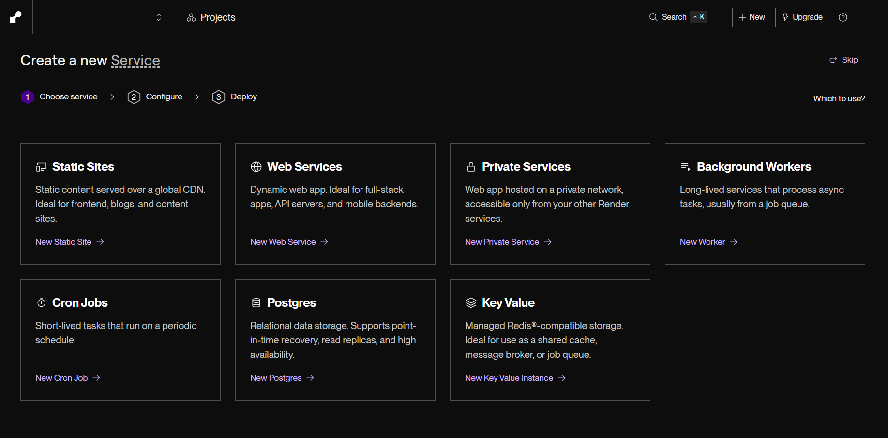
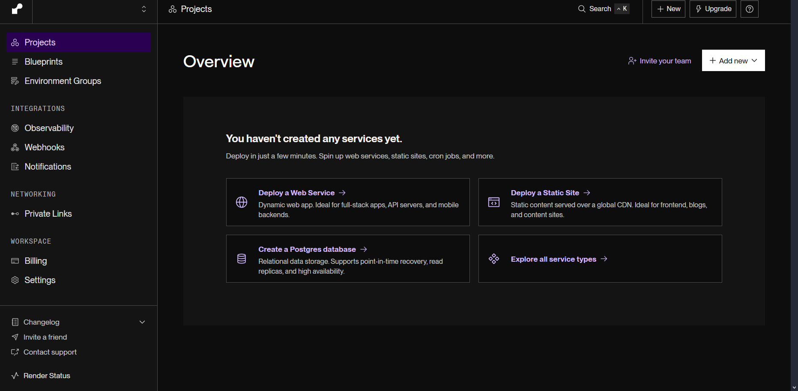
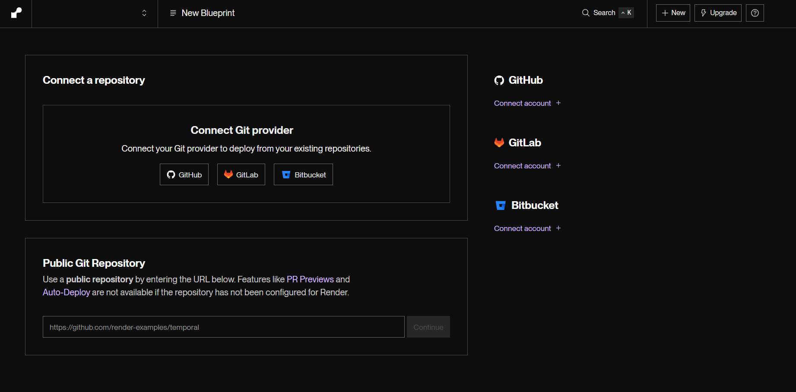
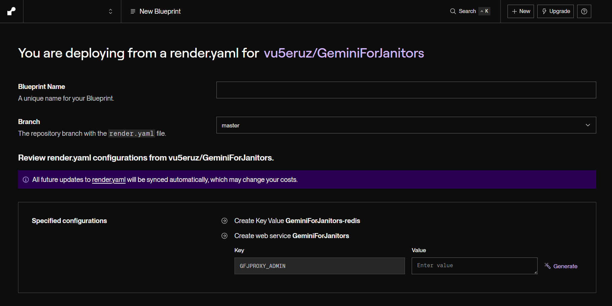
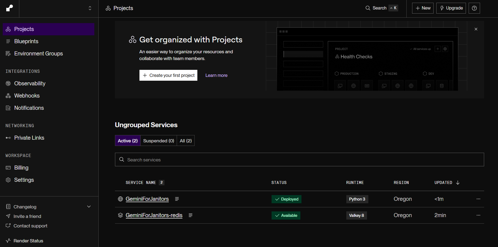
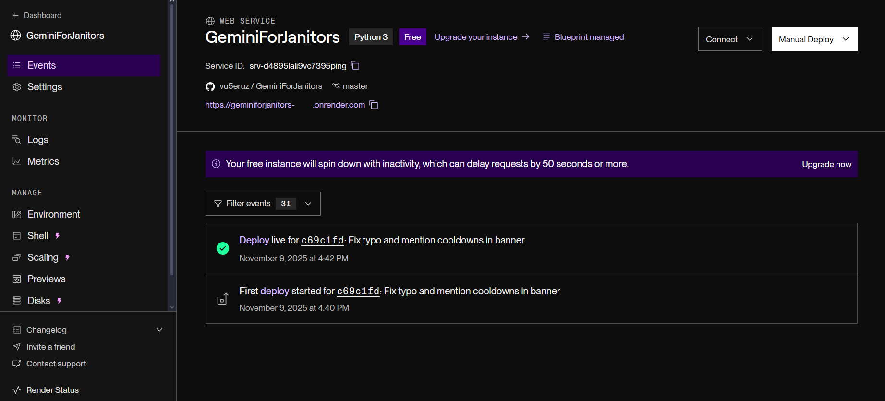

<div align="center">
  
  <h3>GeminiForJanitors</h3>
  <p>Google AI Studio Proxy for JanitorAI</p>
</div>

<hr />

#### Running (for Developers)

Before you can run the proxy inside a local/development environment, you need to export the environmental variable `GFJPROXY_DEVELOPMENT` set to any non-empty value. Otherwise, the proxy will assume a cloud/production deployment and demand more configuration.

Any one of the following commands can be used to run the proxy. Running the proxy with `gunicorn` is the preferred way for a cloud/production deployment. Note that the code base assumes host 127.0.0.1 port number 5000, and thus it's not safe to specify other values.

```sh
flask --app gfjproxy.app run -h 127.0.0.1 -p 5000
gunicorn -b 127.0.0.1:5000 -k gevent -w 3 -t 65 gfjproxy.app
waitress-serve --listen=127.0.0.1:5000 gfjproxy.app.app
```

For local/development, you might want to get a trycloudflared link to use with JanitorAI. For that, export the path to the `cloudflared` executable in the environment variable `GFJPROXY_CLOUDFLARED`. The proxy will automatically get a tunnel that you can use with JanitorAI.

#### Deploying on Render

You must first create a Render account, bound to a monthly 100 GB bandwidth quota if you use the free tier, with which you will be able to host one proxy instance. If you see this screen after signing in, press **Skip**.



You should make it to your dashboard or workspace page, then go to the **Blueprints** tab.



Once you are in the New Blueprint page, copy-paste https://github.com/vu5eruz/GeminiForJanitors into the **Public Git Repository** field and press **Continue**.



Put "gfjproxy" (without quotes) into **Blueprint Name**.

Put your contacts into the value of **GFJPROXY_ADMIN**, such as your Discord or JanitorAI handles or just your name, otherwise your proxy will say it is hosted by Anonymous.

Put how long the cooldown time will be *in seconds* into the value of **GFJPROXY_COOLDOWN**. This will help reduce the load on you proxy if you have a large number of users and you are bound to the 100 GB bandwidth quota.

If you have a Render API key for your account (you can get one in https://dashboard.render.com/u/settings?add-api-key), you can put it into the value of **GFJPROXY_RENDER_API_KEY** to make your proxy track its own bandwidth usage, enabling *adaptive cooldown*.



With this, your proxy should be up and running shortly. If you go back to your dashboard/workspace, you can click on **GeminiForJanitors** (not to be confused with *GeminiForJanitors-redis*) and see your URL, as well as have access to the proxy's Logs and Metrics tabs.





Use the **Logs** tab to see how people use your proxy and diagnose any errors. Use the **Metrics** tab to see how much bandwidth has been used.

You can change the cooldown time anytime by going into the **Environment** tab and changing the value of GFJPROXY_COOLDOWN.

#### Adaptive Cooldown

It is possible to make the proxy apply a cooldown only if the bandwidth usage is above a given value, by configuring the GFJPROXY_COOLDOWN value. For example, consider the following *cooldown policy*:

- Apply a 30 seconds cooldown by default.
- Apply a 60 seconds cooldown is bandwidth usage is above 70 GB.
- Apply a 90 seconds cooldown is bandwidth usage is above 80 GB.

To set up such a policy, set GFJPROXY_COOLDOWN to:

```
30, 60:70, 90:80
```
